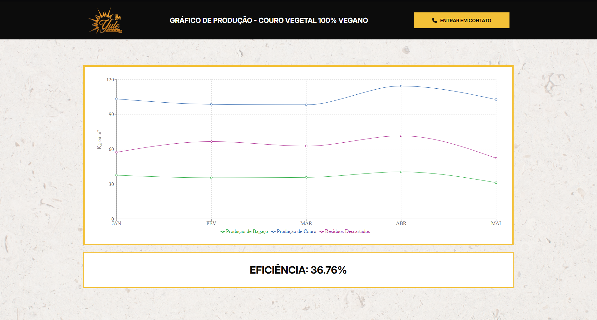

# 🌐 Eco-Leather Dashboard - React.js

This web-based dashboard, built with **React.js**, provides ant interface for monitoring the **conversion of spent malt grain into eco-leather** used in sustainable products. It fetches real-time data from Firebase to generate analitycs and graphs about the production impact.

## 🖼️ Preview

## 🔎 Features
- 📊 Interactive chars showing:
  - Monthly number of redeemed gifts
  - Amount of malt grain (in kg) used
  - Amount of leather (in m²) generated
  - Estimated grain loss
- 🔁 Real-time data fetched from Firebase Firestore
- 📁 Organized by month and product type

## ⚡ Firebase Integration

This dashboard connects directly to **Firebase Firestore** to read:
- Monthly redemption logs
- Product metadata (leather area & grain weight per unit)
- Dynamic calculation of spent grain loss:
  TotalLoss = TotalMonthlyGrain - RedeemedGrain

** 📦 Tech Stack
- React.js (Create React App)
- Firebase Firestore
- Recharts
- JavaScript

## ♻️ Purpose
This dashboard helps the brewery track the transformation of brewing byproducts into eco-conscious items and supports sustainable production monitoring.

## 🔗 Vercel Link:
https://yule-cervejaria-chart.vercel.app/

### Made by **Gustavo Triaquim**
